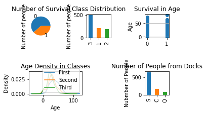

# Titanic on Kaggle
Titanic problem is a basic data analysis example.


```python
import pandas as pd 
import numpy as np 
from pandas import Series,DataFrame

data_train = pd.read_csv("/Users/zhijun/Desktop/Titanic/all/train.csv")
data_train.columns
```


    Index(['PassengerId', 'Survived', 'Pclass', 'Name', 'Sex', 'Age', 'SibSp',
           'Parch', 'Ticket', 'Fare', 'Cabin', 'Embarked'],
          dtype='object')


```python
data_train.info()
```
Let's find out charateristics of each variables.

    <class 'pandas.core.frame.DataFrame'>
    RangeIndex: 891 entries, 0 to 890
    Data columns (total 12 columns):
    PassengerId    891 non-null int64
    Survived       891 non-null int64
    Pclass         891 non-null int64
    Name           891 non-null object
    Sex            891 non-null object
    Age            714 non-null float64
    SibSp          891 non-null int64
    Parch          891 non-null int64
    Ticket         891 non-null object
    Fare           891 non-null float64
    Cabin          204 non-null object
    Embarked       889 non-null object
    dtypes: float64(2), int64(5), object(5)
    memory usage: 83.6+ KB


```python
data_train.describe()
```


<div>
<style scoped>
    .dataframe tbody tr th:only-of-type {
        vertical-align: middle;
    }

    .dataframe tbody tr th {
        vertical-align: top;
    }

    .dataframe thead th {
        text-align: right;
    }
</style>
<table border="1" class="dataframe">
  <thead>
    <tr style="text-align: right;">
      <th></th>
      <th>PassengerId</th>
      <th>Survived</th>
      <th>Pclass</th>
      <th>Age</th>
      <th>SibSp</th>
      <th>Parch</th>
      <th>Fare</th>
    </tr>
  </thead>
  <tbody>
    <tr>
      <th>count</th>
      <td>891.000000</td>
      <td>891.000000</td>
      <td>891.000000</td>
      <td>714.000000</td>
      <td>891.000000</td>
      <td>891.000000</td>
      <td>891.000000</td>
    </tr>
    <tr>
      <th>mean</th>
      <td>446.000000</td>
      <td>0.383838</td>
      <td>2.308642</td>
      <td>29.699118</td>
      <td>0.523008</td>
      <td>0.381594</td>
      <td>32.204208</td>
    </tr>
    <tr>
      <th>std</th>
      <td>257.353842</td>
      <td>0.486592</td>
      <td>0.836071</td>
      <td>14.526497</td>
      <td>1.102743</td>
      <td>0.806057</td>
      <td>49.693429</td>
    </tr>
    <tr>
      <th>min</th>
      <td>1.000000</td>
      <td>0.000000</td>
      <td>1.000000</td>
      <td>0.420000</td>
      <td>0.000000</td>
      <td>0.000000</td>
      <td>0.000000</td>
    </tr>
    <tr>
      <th>25%</th>
      <td>223.500000</td>
      <td>0.000000</td>
      <td>2.000000</td>
      <td>20.125000</td>
      <td>0.000000</td>
      <td>0.000000</td>
      <td>7.910400</td>
    </tr>
    <tr>
      <th>50%</th>
      <td>446.000000</td>
      <td>0.000000</td>
      <td>3.000000</td>
      <td>28.000000</td>
      <td>0.000000</td>
      <td>0.000000</td>
      <td>14.454200</td>
    </tr>
    <tr>
      <th>75%</th>
      <td>668.500000</td>
      <td>1.000000</td>
      <td>3.000000</td>
      <td>38.000000</td>
      <td>1.000000</td>
      <td>0.000000</td>
      <td>31.000000</td>
    </tr>
    <tr>
      <th>max</th>
      <td>891.000000</td>
      <td>1.000000</td>
      <td>3.000000</td>
      <td>80.000000</td>
      <td>8.000000</td>
      <td>6.000000</td>
      <td>512.329200</td>
    </tr>
  </tbody>
</table>
</div>


```python
import matplotlib.pyplot as plt
fig = plt.figure()
fig.set(alpha=0.2)  # 设定图表颜色alpha参数

plt.subplot2grid((4,6),(0,0))
data_train.Survived.value_counts().plot(kind='pie')
plt.title('Number of Survival')
plt.ylabel('Number of people')

plt.subplot2grid((4,6),(0,2))
data_train.Pclass.value_counts().plot(kind='bar')
plt.title('Class Distribution')
plt.ylabel('Number of people')

plt.subplot2grid((4,6),(0,4))
plt.scatter(data_train.Survived,data_train.Age)
plt.ylabel('Age')
plt.grid(b=True, which='major', axis='y')# 显示网格线
plt.title('Survival in Age')

plt.subplot2grid((4,6),(2,0),colspan=2)
data_train.Age[data_train.Pclass==1].plot(kind='kde')
data_train.Age[data_train.Pclass==2].plot(kind='kde')
data_train.Age[data_train.Pclass==3].plot(kind='kde')
plt.xlabel('Age')
plt.ylabel('Density')
plt.title('Age Density in Classes')
plt.legend(('First', 'Second','Third'),loc='best')

plt.subplot2grid((4,6),(2,4))
data_train.Embarked.value_counts().plot(kind='bar')
plt.title('Number of People from Docks')
plt.ylabel('Nubmber of People')  
plt.show()
```





```python

fig = plt.figure()

fig1=fig.add_subplot(141)
data_train.Survived[data_train.Pclass !=3][data_train.Sex=='female'].value_counts().plot(kind='bar',label='Female in High Cabin',color='green')
plt.ylabel('Number of People')
plt.title('Female in High Cabin')

fig2=fig.add_subplot(142,sharey=fig1)
data_train.Survived[data_train.Pclass==3][data_train.Sex=='female'].value_counts().plot(kind='bar',label='Female in Low Cabin',color='red')
plt.ylabel('Number of People')
plt.title('Female in Low Cabin')

fig3=fig.add_subplot(143,sharey=fig1)
data_train.Survived[data_train.Pclass != 3][data_train.Sex=='male'].value_counts().plot(kind='bar',color='blue')
plt.ylabel('Number of People')
plt.title('Male in High Cabin')

fig4=fig.add_subplot(144,sharey=fig1)
data_train.Survived[data_train.Pclass==3][data_train.Sex=='male'].value_counts().plot(kind='bar',color='orange')
plt.ylabel('Number of People')
plt.title('Male in Low Cabin')
```


    Text(0.5,1,'Male in Low Cabin')


```python
new=data_train.groupby(['SibSp','Survived'])
f=pd.DataFrame(new.count()['PassengerId'])
f
```


<div>
<style scoped>
    .dataframe tbody tr th:only-of-type {
        vertical-align: middle;
    }

    .dataframe tbody tr th {
        vertical-align: top;
    }

    .dataframe thead th {
        text-align: right;
    }
</style>
<table border="1" class="dataframe">
  <thead>
    <tr style="text-align: right;">
      <th></th>
      <th></th>
      <th>PassengerId</th>
    </tr>
    <tr>
      <th>SibSp</th>
      <th>Survived</th>
      <th></th>
    </tr>
  </thead>
  <tbody>
    <tr>
      <th rowspan="2" valign="top">0</th>
      <th>0</th>
      <td>398</td>
    </tr>
    <tr>
      <th>1</th>
      <td>210</td>
    </tr>
    <tr>
      <th rowspan="2" valign="top">1</th>
      <th>0</th>
      <td>97</td>
    </tr>
    <tr>
      <th>1</th>
      <td>112</td>
    </tr>
    <tr>
      <th rowspan="2" valign="top">2</th>
      <th>0</th>
      <td>15</td>
    </tr>
    <tr>
      <th>1</th>
      <td>13</td>
    </tr>
    <tr>
      <th rowspan="2" valign="top">3</th>
      <th>0</th>
      <td>12</td>
    </tr>
    <tr>
      <th>1</th>
      <td>4</td>
    </tr>
    <tr>
      <th rowspan="2" valign="top">4</th>
      <th>0</th>
      <td>15</td>
    </tr>
    <tr>
      <th>1</th>
      <td>3</td>
    </tr>
    <tr>
      <th>5</th>
      <th>0</th>
      <td>5</td>
    </tr>
    <tr>
      <th>8</th>
      <th>0</th>
      <td>7</td>
    </tr>
  </tbody>
</table>
</div>


```python
p=data_train.groupby(['Parch','Survived'])
f=pd.DataFrame(p.count()['PassengerId'])
f
```


<div>
<style scoped>
    .dataframe tbody tr th:only-of-type {
        vertical-align: middle;
    }

    .dataframe tbody tr th {
        vertical-align: top;
    }

    .dataframe thead th {
        text-align: right;
    }
</style>
<table border="1" class="dataframe">
  <thead>
    <tr style="text-align: right;">
      <th></th>
      <th></th>
      <th>PassengerId</th>
    </tr>
    <tr>
      <th>Parch</th>
      <th>Survived</th>
      <th></th>
    </tr>
  </thead>
  <tbody>
    <tr>
      <th rowspan="2" valign="top">0</th>
      <th>0</th>
      <td>445</td>
    </tr>
    <tr>
      <th>1</th>
      <td>233</td>
    </tr>
    <tr>
      <th rowspan="2" valign="top">1</th>
      <th>0</th>
      <td>53</td>
    </tr>
    <tr>
      <th>1</th>
      <td>65</td>
    </tr>
    <tr>
      <th rowspan="2" valign="top">2</th>
      <th>0</th>
      <td>40</td>
    </tr>
    <tr>
      <th>1</th>
      <td>40</td>
    </tr>
    <tr>
      <th rowspan="2" valign="top">3</th>
      <th>0</th>
      <td>2</td>
    </tr>
    <tr>
      <th>1</th>
      <td>3</td>
    </tr>
    <tr>
      <th>4</th>
      <th>0</th>
      <td>4</td>
    </tr>
    <tr>
      <th rowspan="2" valign="top">5</th>
      <th>0</th>
      <td>4</td>
    </tr>
    <tr>
      <th>1</th>
      <td>1</td>
    </tr>
    <tr>
      <th>6</th>
      <th>0</th>
      <td>1</td>
    </tr>
  </tbody>
</table>
</div>


```python
from sklearn.ensemble import RandomForestRegressor# 使用 RandomForestClassifier 填补缺失的年龄属性
```


```python
def set_missing_ages(df):
    
    # 把已有的数值型特征取出来丢进Random Forest Regressor中
    age_df = df[['Age','Fare', 'Parch', 'SibSp', 'Pclass']]

    # 乘客分成已知年龄和未知年龄两部分
    known_age = age_df[age_df.Age.notnull()].as_matrix()
    unknown_age = age_df[age_df.Age.isnull()].as_matrix()

    # y即目标年龄
    y = known_age[:, 0]

    # X即特征属性值
    X = known_age[:, 1:]

    # fit到RandomForestRegressor之中
    rfr = RandomForestRegressor(random_state=0, n_estimators=2000, n_jobs=-1)
    rfr.fit(X, y)
    
    # 用得到的模型进行未知年龄结果预测
    predictedAges = rfr.predict(unknown_age[:, 1::])
    
    # 用得到的预测结果填补原缺失数据
    df.loc[ (df.Age.isnull()), 'Age' ] = predictedAges 
    
    return df, rfr

def set_Cabin_type(df):
    df.loc[ (df.Cabin.notnull()), 'Cabin' ] = "Yes"
    df.loc[ (df.Cabin.isnull()), 'Cabin' ] = "No"
    return df

data_train, rfr = set_missing_ages(data_train)
data_train = set_Cabin_type(data_train)
data_train
```


<div>
<style scoped>
    .dataframe tbody tr th:only-of-type {
        vertical-align: middle;
    }

    .dataframe tbody tr th {
        vertical-align: top;
    }

    .dataframe thead th {
        text-align: right;
    }
</style>
<table border="1" class="dataframe">
  <thead>
    <tr style="text-align: right;">
      <th></th>
      <th>PassengerId</th>
      <th>Survived</th>
      <th>Pclass</th>
      <th>Name</th>
      <th>Sex</th>
      <th>Age</th>
      <th>SibSp</th>
      <th>Parch</th>
      <th>Ticket</th>
      <th>Fare</th>
      <th>Cabin</th>
      <th>Embarked</th>
    </tr>
  </thead>
  <tbody>
    <tr>
      <th>0</th>
      <td>1</td>
      <td>0</td>
      <td>3</td>
      <td>Braund, Mr. Owen Harris</td>
      <td>male</td>
      <td>22.000000</td>
      <td>1</td>
      <td>0</td>
      <td>A/5 21171</td>
      <td>7.2500</td>
      <td>No</td>
      <td>S</td>
    </tr>
    <tr>
      <th>1</th>
      <td>2</td>
      <td>1</td>
      <td>1</td>
      <td>Cumings, Mrs. John Bradley (Florence Briggs Th...</td>
      <td>female</td>
      <td>38.000000</td>
      <td>1</td>
      <td>0</td>
      <td>PC 17599</td>
      <td>71.2833</td>
      <td>Yes</td>
      <td>C</td>
    </tr>
    <tr>
      <th>2</th>
      <td>3</td>
      <td>1</td>
      <td>3</td>
      <td>Heikkinen, Miss. Laina</td>
      <td>female</td>
      <td>26.000000</td>
      <td>0</td>
      <td>0</td>
      <td>STON/O2. 3101282</td>
      <td>7.9250</td>
      <td>No</td>
      <td>S</td>
    </tr>
    <tr>
      <th>3</th>
      <td>4</td>
      <td>1</td>
      <td>1</td>
      <td>Futrelle, Mrs. Jacques Heath (Lily May Peel)</td>
      <td>female</td>
      <td>35.000000</td>
      <td>1</td>
      <td>0</td>
      <td>113803</td>
      <td>53.1000</td>
      <td>Yes</td>
      <td>S</td>
    </tr>
    <tr>
      <th>4</th>
      <td>5</td>
      <td>0</td>
      <td>3</td>
      <td>Allen, Mr. William Henry</td>
      <td>male</td>
      <td>35.000000</td>
      <td>0</td>
      <td>0</td>
      <td>373450</td>
      <td>8.0500</td>
      <td>No</td>
      <td>S</td>
    </tr>
    <tr>
      <th>5</th>
      <td>6</td>
      <td>0</td>
      <td>3</td>
      <td>Moran, Mr. James</td>
      <td>male</td>
      <td>23.838953</td>
      <td>0</td>
      <td>0</td>
      <td>330877</td>
      <td>8.4583</td>
      <td>No</td>
      <td>Q</td>
    </tr>
    <tr>
      <th>6</th>
      <td>7</td>
      <td>0</td>
      <td>1</td>
      <td>McCarthy, Mr. Timothy J</td>
      <td>male</td>
      <td>54.000000</td>
      <td>0</td>
      <td>0</td>
      <td>17463</td>
      <td>51.8625</td>
      <td>Yes</td>
      <td>S</td>
    </tr>
    <tr>
      <th>7</th>
      <td>8</td>
      <td>0</td>
      <td>3</td>
      <td>Palsson, Master. Gosta Leonard</td>
      <td>male</td>
      <td>2.000000</td>
      <td>3</td>
      <td>1</td>
      <td>349909</td>
      <td>21.0750</td>
      <td>No</td>
      <td>S</td>
    </tr>
    <tr>
      <th>8</th>
      <td>9</td>
      <td>1</td>
      <td>3</td>
      <td>Johnson, Mrs. Oscar W (Elisabeth Vilhelmina Berg)</td>
      <td>female</td>
      <td>27.000000</td>
      <td>0</td>
      <td>2</td>
      <td>347742</td>
      <td>11.1333</td>
      <td>No</td>
      <td>S</td>
    </tr>
    <tr>
      <th>9</th>
      <td>10</td>
      <td>1</td>
      <td>2</td>
      <td>Nasser, Mrs. Nicholas (Adele Achem)</td>
      <td>female</td>
      <td>14.000000</td>
      <td>1</td>
      <td>0</td>
      <td>237736</td>
      <td>30.0708</td>
      <td>No</td>
      <td>C</td>
    </tr>
    <tr>
      <th>10</th>
      <td>11</td>
      <td>1</td>
      <td>3</td>
      <td>Sandstrom, Miss. Marguerite Rut</td>
      <td>female</td>
      <td>4.000000</td>
      <td>1</td>
      <td>1</td>
      <td>PP 9549</td>
      <td>16.7000</td>
      <td>Yes</td>
      <td>S</td>
    </tr>
    <tr>
      <th>11</th>
      <td>12</td>
      <td>1</td>
      <td>1</td>
      <td>Bonnell, Miss. Elizabeth</td>
      <td>female</td>
      <td>58.000000</td>
      <td>0</td>
      <td>0</td>
      <td>113783</td>
      <td>26.5500</td>
      <td>Yes</td>
      <td>S</td>
    </tr>
    <tr>
      <th>12</th>
      <td>13</td>
      <td>0</td>
      <td>3</td>
      <td>Saundercock, Mr. William Henry</td>
      <td>male</td>
      <td>20.000000</td>
      <td>0</td>
      <td>0</td>
      <td>A/5. 2151</td>
      <td>8.0500</td>
      <td>No</td>
      <td>S</td>
    </tr>
    <tr>
      <th>13</th>
      <td>14</td>
      <td>0</td>
      <td>3</td>
      <td>Andersson, Mr. Anders Johan</td>
      <td>male</td>
      <td>39.000000</td>
      <td>1</td>
      <td>5</td>
      <td>347082</td>
      <td>31.2750</td>
      <td>No</td>
      <td>S</td>
    </tr>
    <tr>
      <th>14</th>
      <td>15</td>
      <td>0</td>
      <td>3</td>
      <td>Vestrom, Miss. Hulda Amanda Adolfina</td>
      <td>female</td>
      <td>14.000000</td>
      <td>0</td>
      <td>0</td>
      <td>350406</td>
      <td>7.8542</td>
      <td>No</td>
      <td>S</td>
    </tr>
    <tr>
      <th>15</th>
      <td>16</td>
      <td>1</td>
      <td>2</td>
      <td>Hewlett, Mrs. (Mary D Kingcome)</td>
      <td>female</td>
      <td>55.000000</td>
      <td>0</td>
      <td>0</td>
      <td>248706</td>
      <td>16.0000</td>
      <td>No</td>
      <td>S</td>
    </tr>
    <tr>
      <th>16</th>
      <td>17</td>
      <td>0</td>
      <td>3</td>
      <td>Rice, Master. Eugene</td>
      <td>male</td>
      <td>2.000000</td>
      <td>4</td>
      <td>1</td>
      <td>382652</td>
      <td>29.1250</td>
      <td>No</td>
      <td>Q</td>
    </tr>
    <tr>
      <th>17</th>
      <td>18</td>
      <td>1</td>
      <td>2</td>
      <td>Williams, Mr. Charles Eugene</td>
      <td>male</td>
      <td>32.066493</td>
      <td>0</td>
      <td>0</td>
      <td>244373</td>
      <td>13.0000</td>
      <td>No</td>
      <td>S</td>
    </tr>
    <tr>
      <th>18</th>
      <td>19</td>
      <td>0</td>
      <td>3</td>
      <td>Vander Planke, Mrs. Julius (Emelia Maria Vande...</td>
      <td>female</td>
      <td>31.000000</td>
      <td>1</td>
      <td>0</td>
      <td>345763</td>
      <td>18.0000</td>
      <td>No</td>
      <td>S</td>
    </tr>
    <tr>
      <th>19</th>
      <td>20</td>
      <td>1</td>
      <td>3</td>
      <td>Masselmani, Mrs. Fatima</td>
      <td>female</td>
      <td>29.518205</td>
      <td>0</td>
      <td>0</td>
      <td>2649</td>
      <td>7.2250</td>
      <td>No</td>
      <td>C</td>
    </tr>
    <tr>
      <th>20</th>
      <td>21</td>
      <td>0</td>
      <td>2</td>
      <td>Fynney, Mr. Joseph J</td>
      <td>male</td>
      <td>35.000000</td>
      <td>0</td>
      <td>0</td>
      <td>239865</td>
      <td>26.0000</td>
      <td>No</td>
      <td>S</td>
    </tr>
    <tr>
      <th>21</th>
      <td>22</td>
      <td>1</td>
      <td>2</td>
      <td>Beesley, Mr. Lawrence</td>
      <td>male</td>
      <td>34.000000</td>
      <td>0</td>
      <td>0</td>
      <td>248698</td>
      <td>13.0000</td>
      <td>Yes</td>
      <td>S</td>
    </tr>
    <tr>
      <th>22</th>
      <td>23</td>
      <td>1</td>
      <td>3</td>
      <td>McGowan, Miss. Anna "Annie"</td>
      <td>female</td>
      <td>15.000000</td>
      <td>0</td>
      <td>0</td>
      <td>330923</td>
      <td>8.0292</td>
      <td>No</td>
      <td>Q</td>
    </tr>
    <tr>
      <th>23</th>
      <td>24</td>
      <td>1</td>
      <td>1</td>
      <td>Sloper, Mr. William Thompson</td>
      <td>male</td>
      <td>28.000000</td>
      <td>0</td>
      <td>0</td>
      <td>113788</td>
      <td>35.5000</td>
      <td>Yes</td>
      <td>S</td>
    </tr>
    <tr>
      <th>24</th>
      <td>25</td>
      <td>0</td>
      <td>3</td>
      <td>Palsson, Miss. Torborg Danira</td>
      <td>female</td>
      <td>8.000000</td>
      <td>3</td>
      <td>1</td>
      <td>349909</td>
      <td>21.0750</td>
      <td>No</td>
      <td>S</td>
    </tr>
    <tr>
      <th>25</th>
      <td>26</td>
      <td>1</td>
      <td>3</td>
      <td>Asplund, Mrs. Carl Oscar (Selma Augusta Emilia...</td>
      <td>female</td>
      <td>38.000000</td>
      <td>1</td>
      <td>5</td>
      <td>347077</td>
      <td>31.3875</td>
      <td>No</td>
      <td>S</td>
    </tr>
    <tr>
      <th>26</th>
      <td>27</td>
      <td>0</td>
      <td>3</td>
      <td>Emir, Mr. Farred Chehab</td>
      <td>male</td>
      <td>29.518205</td>
      <td>0</td>
      <td>0</td>
      <td>2631</td>
      <td>7.2250</td>
      <td>No</td>
      <td>C</td>
    </tr>
    <tr>
      <th>27</th>
      <td>28</td>
      <td>0</td>
      <td>1</td>
      <td>Fortune, Mr. Charles Alexander</td>
      <td>male</td>
      <td>19.000000</td>
      <td>3</td>
      <td>2</td>
      <td>19950</td>
      <td>263.0000</td>
      <td>Yes</td>
      <td>S</td>
    </tr>
    <tr>
      <th>28</th>
      <td>29</td>
      <td>1</td>
      <td>3</td>
      <td>O'Dwyer, Miss. Ellen "Nellie"</td>
      <td>female</td>
      <td>22.380113</td>
      <td>0</td>
      <td>0</td>
      <td>330959</td>
      <td>7.8792</td>
      <td>No</td>
      <td>Q</td>
    </tr>
    <tr>
      <th>29</th>
      <td>30</td>
      <td>0</td>
      <td>3</td>
      <td>Todoroff, Mr. Lalio</td>
      <td>male</td>
      <td>27.947206</td>
      <td>0</td>
      <td>0</td>
      <td>349216</td>
      <td>7.8958</td>
      <td>No</td>
      <td>S</td>
    </tr>
    <tr>
      <th>...</th>
      <td>...</td>
      <td>...</td>
      <td>...</td>
      <td>...</td>
      <td>...</td>
      <td>...</td>
      <td>...</td>
      <td>...</td>
      <td>...</td>
      <td>...</td>
      <td>...</td>
      <td>...</td>
    </tr>
    <tr>
      <th>861</th>
      <td>862</td>
      <td>0</td>
      <td>2</td>
      <td>Giles, Mr. Frederick Edward</td>
      <td>male</td>
      <td>21.000000</td>
      <td>1</td>
      <td>0</td>
      <td>28134</td>
      <td>11.5000</td>
      <td>No</td>
      <td>S</td>
    </tr>
    <tr>
      <th>862</th>
      <td>863</td>
      <td>1</td>
      <td>1</td>
      <td>Swift, Mrs. Frederick Joel (Margaret Welles Ba...</td>
      <td>female</td>
      <td>48.000000</td>
      <td>0</td>
      <td>0</td>
      <td>17466</td>
      <td>25.9292</td>
      <td>Yes</td>
      <td>S</td>
    </tr>
    <tr>
      <th>863</th>
      <td>864</td>
      <td>0</td>
      <td>3</td>
      <td>Sage, Miss. Dorothy Edith "Dolly"</td>
      <td>female</td>
      <td>10.869867</td>
      <td>8</td>
      <td>2</td>
      <td>CA. 2343</td>
      <td>69.5500</td>
      <td>No</td>
      <td>S</td>
    </tr>
    <tr>
      <th>864</th>
      <td>865</td>
      <td>0</td>
      <td>2</td>
      <td>Gill, Mr. John William</td>
      <td>male</td>
      <td>24.000000</td>
      <td>0</td>
      <td>0</td>
      <td>233866</td>
      <td>13.0000</td>
      <td>No</td>
      <td>S</td>
    </tr>
    <tr>
      <th>865</th>
      <td>866</td>
      <td>1</td>
      <td>2</td>
      <td>Bystrom, Mrs. (Karolina)</td>
      <td>female</td>
      <td>42.000000</td>
      <td>0</td>
      <td>0</td>
      <td>236852</td>
      <td>13.0000</td>
      <td>No</td>
      <td>S</td>
    </tr>
    <tr>
      <th>866</th>
      <td>867</td>
      <td>1</td>
      <td>2</td>
      <td>Duran y More, Miss. Asuncion</td>
      <td>female</td>
      <td>27.000000</td>
      <td>1</td>
      <td>0</td>
      <td>SC/PARIS 2149</td>
      <td>13.8583</td>
      <td>No</td>
      <td>C</td>
    </tr>
    <tr>
      <th>867</th>
      <td>868</td>
      <td>0</td>
      <td>1</td>
      <td>Roebling, Mr. Washington Augustus II</td>
      <td>male</td>
      <td>31.000000</td>
      <td>0</td>
      <td>0</td>
      <td>PC 17590</td>
      <td>50.4958</td>
      <td>Yes</td>
      <td>S</td>
    </tr>
    <tr>
      <th>868</th>
      <td>869</td>
      <td>0</td>
      <td>3</td>
      <td>van Melkebeke, Mr. Philemon</td>
      <td>male</td>
      <td>25.977889</td>
      <td>0</td>
      <td>0</td>
      <td>345777</td>
      <td>9.5000</td>
      <td>No</td>
      <td>S</td>
    </tr>
    <tr>
      <th>869</th>
      <td>870</td>
      <td>1</td>
      <td>3</td>
      <td>Johnson, Master. Harold Theodor</td>
      <td>male</td>
      <td>4.000000</td>
      <td>1</td>
      <td>1</td>
      <td>347742</td>
      <td>11.1333</td>
      <td>No</td>
      <td>S</td>
    </tr>
    <tr>
      <th>870</th>
      <td>871</td>
      <td>0</td>
      <td>3</td>
      <td>Balkic, Mr. Cerin</td>
      <td>male</td>
      <td>26.000000</td>
      <td>0</td>
      <td>0</td>
      <td>349248</td>
      <td>7.8958</td>
      <td>No</td>
      <td>S</td>
    </tr>
    <tr>
      <th>871</th>
      <td>872</td>
      <td>1</td>
      <td>1</td>
      <td>Beckwith, Mrs. Richard Leonard (Sallie Monypeny)</td>
      <td>female</td>
      <td>47.000000</td>
      <td>1</td>
      <td>1</td>
      <td>11751</td>
      <td>52.5542</td>
      <td>Yes</td>
      <td>S</td>
    </tr>
    <tr>
      <th>872</th>
      <td>873</td>
      <td>0</td>
      <td>1</td>
      <td>Carlsson, Mr. Frans Olof</td>
      <td>male</td>
      <td>33.000000</td>
      <td>0</td>
      <td>0</td>
      <td>695</td>
      <td>5.0000</td>
      <td>Yes</td>
      <td>S</td>
    </tr>
    <tr>
      <th>873</th>
      <td>874</td>
      <td>0</td>
      <td>3</td>
      <td>Vander Cruyssen, Mr. Victor</td>
      <td>male</td>
      <td>47.000000</td>
      <td>0</td>
      <td>0</td>
      <td>345765</td>
      <td>9.0000</td>
      <td>No</td>
      <td>S</td>
    </tr>
    <tr>
      <th>874</th>
      <td>875</td>
      <td>1</td>
      <td>2</td>
      <td>Abelson, Mrs. Samuel (Hannah Wizosky)</td>
      <td>female</td>
      <td>28.000000</td>
      <td>1</td>
      <td>0</td>
      <td>P/PP 3381</td>
      <td>24.0000</td>
      <td>No</td>
      <td>C</td>
    </tr>
    <tr>
      <th>875</th>
      <td>876</td>
      <td>1</td>
      <td>3</td>
      <td>Najib, Miss. Adele Kiamie "Jane"</td>
      <td>female</td>
      <td>15.000000</td>
      <td>0</td>
      <td>0</td>
      <td>2667</td>
      <td>7.2250</td>
      <td>No</td>
      <td>C</td>
    </tr>
    <tr>
      <th>876</th>
      <td>877</td>
      <td>0</td>
      <td>3</td>
      <td>Gustafsson, Mr. Alfred Ossian</td>
      <td>male</td>
      <td>20.000000</td>
      <td>0</td>
      <td>0</td>
      <td>7534</td>
      <td>9.8458</td>
      <td>No</td>
      <td>S</td>
    </tr>
    <tr>
      <th>877</th>
      <td>878</td>
      <td>0</td>
      <td>3</td>
      <td>Petroff, Mr. Nedelio</td>
      <td>male</td>
      <td>19.000000</td>
      <td>0</td>
      <td>0</td>
      <td>349212</td>
      <td>7.8958</td>
      <td>No</td>
      <td>S</td>
    </tr>
    <tr>
      <th>878</th>
      <td>879</td>
      <td>0</td>
      <td>3</td>
      <td>Laleff, Mr. Kristo</td>
      <td>male</td>
      <td>27.947206</td>
      <td>0</td>
      <td>0</td>
      <td>349217</td>
      <td>7.8958</td>
      <td>No</td>
      <td>S</td>
    </tr>
    <tr>
      <th>879</th>
      <td>880</td>
      <td>1</td>
      <td>1</td>
      <td>Potter, Mrs. Thomas Jr (Lily Alexenia Wilson)</td>
      <td>female</td>
      <td>56.000000</td>
      <td>0</td>
      <td>1</td>
      <td>11767</td>
      <td>83.1583</td>
      <td>Yes</td>
      <td>C</td>
    </tr>
    <tr>
      <th>880</th>
      <td>881</td>
      <td>1</td>
      <td>2</td>
      <td>Shelley, Mrs. William (Imanita Parrish Hall)</td>
      <td>female</td>
      <td>25.000000</td>
      <td>0</td>
      <td>1</td>
      <td>230433</td>
      <td>26.0000</td>
      <td>No</td>
      <td>S</td>
    </tr>
    <tr>
      <th>881</th>
      <td>882</td>
      <td>0</td>
      <td>3</td>
      <td>Markun, Mr. Johann</td>
      <td>male</td>
      <td>33.000000</td>
      <td>0</td>
      <td>0</td>
      <td>349257</td>
      <td>7.8958</td>
      <td>No</td>
      <td>S</td>
    </tr>
    <tr>
      <th>882</th>
      <td>883</td>
      <td>0</td>
      <td>3</td>
      <td>Dahlberg, Miss. Gerda Ulrika</td>
      <td>female</td>
      <td>22.000000</td>
      <td>0</td>
      <td>0</td>
      <td>7552</td>
      <td>10.5167</td>
      <td>No</td>
      <td>S</td>
    </tr>
    <tr>
      <th>883</th>
      <td>884</td>
      <td>0</td>
      <td>2</td>
      <td>Banfield, Mr. Frederick James</td>
      <td>male</td>
      <td>28.000000</td>
      <td>0</td>
      <td>0</td>
      <td>C.A./SOTON 34068</td>
      <td>10.5000</td>
      <td>No</td>
      <td>S</td>
    </tr>
    <tr>
      <th>884</th>
      <td>885</td>
      <td>0</td>
      <td>3</td>
      <td>Sutehall, Mr. Henry Jr</td>
      <td>male</td>
      <td>25.000000</td>
      <td>0</td>
      <td>0</td>
      <td>SOTON/OQ 392076</td>
      <td>7.0500</td>
      <td>No</td>
      <td>S</td>
    </tr>
    <tr>
      <th>885</th>
      <td>886</td>
      <td>0</td>
      <td>3</td>
      <td>Rice, Mrs. William (Margaret Norton)</td>
      <td>female</td>
      <td>39.000000</td>
      <td>0</td>
      <td>5</td>
      <td>382652</td>
      <td>29.1250</td>
      <td>No</td>
      <td>Q</td>
    </tr>
    <tr>
      <th>886</th>
      <td>887</td>
      <td>0</td>
      <td>2</td>
      <td>Montvila, Rev. Juozas</td>
      <td>male</td>
      <td>27.000000</td>
      <td>0</td>
      <td>0</td>
      <td>211536</td>
      <td>13.0000</td>
      <td>No</td>
      <td>S</td>
    </tr>
    <tr>
      <th>887</th>
      <td>888</td>
      <td>1</td>
      <td>1</td>
      <td>Graham, Miss. Margaret Edith</td>
      <td>female</td>
      <td>19.000000</td>
      <td>0</td>
      <td>0</td>
      <td>112053</td>
      <td>30.0000</td>
      <td>Yes</td>
      <td>S</td>
    </tr>
    <tr>
      <th>888</th>
      <td>889</td>
      <td>0</td>
      <td>3</td>
      <td>Johnston, Miss. Catherine Helen "Carrie"</td>
      <td>female</td>
      <td>16.193950</td>
      <td>1</td>
      <td>2</td>
      <td>W./C. 6607</td>
      <td>23.4500</td>
      <td>No</td>
      <td>S</td>
    </tr>
    <tr>
      <th>889</th>
      <td>890</td>
      <td>1</td>
      <td>1</td>
      <td>Behr, Mr. Karl Howell</td>
      <td>male</td>
      <td>26.000000</td>
      <td>0</td>
      <td>0</td>
      <td>111369</td>
      <td>30.0000</td>
      <td>Yes</td>
      <td>C</td>
    </tr>
    <tr>
      <th>890</th>
      <td>891</td>
      <td>0</td>
      <td>3</td>
      <td>Dooley, Mr. Patrick</td>
      <td>male</td>
      <td>32.000000</td>
      <td>0</td>
      <td>0</td>
      <td>370376</td>
      <td>7.7500</td>
      <td>No</td>
      <td>Q</td>
    </tr>
  </tbody>
</table>
<p>891 rows × 12 columns</p>
</div>


```python
def set_Cabin_type(df):
    df.loc[ (df.Cabin.notnull()), 'Cabin' ] = "Yes"
    df.loc[ (df.Cabin.isnull()), 'Cabin' ] = "No"
    return df
dummy_cabin=pd.get_dummies(data_train['Cabin'],prefix='Cabin')
dummy_Embarked=pd.get_dummies(data_train['Embarked'],prefix='Embarked')
dummy_Sex = pd.get_dummies(data_train['Sex'], prefix= 'Sex')
dummy_Pclass = pd.get_dummies(data_train['Pclass'], prefix= 'Pclass')
df=pd.concat([data_train,dummy_cabin,dummy_Embarked,dummy_Sex,dummy_Pclass],axis=1)
df.drop(['Pclass', 'Name', 'Sex', 'Ticket', 'Cabin', 'Embarked'],axis=1,inplace=True)
df
```


<div>
<style scoped>
    .dataframe tbody tr th:only-of-type {
        vertical-align: middle;
    }

    .dataframe tbody tr th {
        vertical-align: top;
    }

    .dataframe thead th {
        text-align: right;
    }
</style>
<table border="1" class="dataframe">
  <thead>
    <tr style="text-align: right;">
      <th></th>
      <th>PassengerId</th>
      <th>Survived</th>
      <th>Age</th>
      <th>SibSp</th>
      <th>Parch</th>
      <th>Fare</th>
      <th>Cabin_No</th>
      <th>Cabin_Yes</th>
      <th>Embarked_C</th>
      <th>Embarked_Q</th>
      <th>Embarked_S</th>
      <th>Sex_female</th>
      <th>Sex_male</th>
      <th>Pclass_1</th>
      <th>Pclass_2</th>
      <th>Pclass_3</th>
    </tr>
  </thead>
  <tbody>
    <tr>
      <th>0</th>
      <td>1</td>
      <td>0</td>
      <td>22.000000</td>
      <td>1</td>
      <td>0</td>
      <td>7.2500</td>
      <td>1</td>
      <td>0</td>
      <td>0</td>
      <td>0</td>
      <td>1</td>
      <td>0</td>
      <td>1</td>
      <td>0</td>
      <td>0</td>
      <td>1</td>
    </tr>
    <tr>
      <th>1</th>
      <td>2</td>
      <td>1</td>
      <td>38.000000</td>
      <td>1</td>
      <td>0</td>
      <td>71.2833</td>
      <td>0</td>
      <td>1</td>
      <td>1</td>
      <td>0</td>
      <td>0</td>
      <td>1</td>
      <td>0</td>
      <td>1</td>
      <td>0</td>
      <td>0</td>
    </tr>
    <tr>
      <th>2</th>
      <td>3</td>
      <td>1</td>
      <td>26.000000</td>
      <td>0</td>
      <td>0</td>
      <td>7.9250</td>
      <td>1</td>
      <td>0</td>
      <td>0</td>
      <td>0</td>
      <td>1</td>
      <td>1</td>
      <td>0</td>
      <td>0</td>
      <td>0</td>
      <td>1</td>
    </tr>
    <tr>
      <th>3</th>
      <td>4</td>
      <td>1</td>
      <td>35.000000</td>
      <td>1</td>
      <td>0</td>
      <td>53.1000</td>
      <td>0</td>
      <td>1</td>
      <td>0</td>
      <td>0</td>
      <td>1</td>
      <td>1</td>
      <td>0</td>
      <td>1</td>
      <td>0</td>
      <td>0</td>
    </tr>
    <tr>
      <th>4</th>
      <td>5</td>
      <td>0</td>
      <td>35.000000</td>
      <td>0</td>
      <td>0</td>
      <td>8.0500</td>
      <td>1</td>
      <td>0</td>
      <td>0</td>
      <td>0</td>
      <td>1</td>
      <td>0</td>
      <td>1</td>
      <td>0</td>
      <td>0</td>
      <td>1</td>
    </tr>
    <tr>
      <th>5</th>
      <td>6</td>
      <td>0</td>
      <td>23.838953</td>
      <td>0</td>
      <td>0</td>
      <td>8.4583</td>
      <td>1</td>
      <td>0</td>
      <td>0</td>
      <td>1</td>
      <td>0</td>
      <td>0</td>
      <td>1</td>
      <td>0</td>
      <td>0</td>
      <td>1</td>
    </tr>
    <tr>
      <th>6</th>
      <td>7</td>
      <td>0</td>
      <td>54.000000</td>
      <td>0</td>
      <td>0</td>
      <td>51.8625</td>
      <td>0</td>
      <td>1</td>
      <td>0</td>
      <td>0</td>
      <td>1</td>
      <td>0</td>
      <td>1</td>
      <td>1</td>
      <td>0</td>
      <td>0</td>
    </tr>
    <tr>
      <th>7</th>
      <td>8</td>
      <td>0</td>
      <td>2.000000</td>
      <td>3</td>
      <td>1</td>
      <td>21.0750</td>
      <td>1</td>
      <td>0</td>
      <td>0</td>
      <td>0</td>
      <td>1</td>
      <td>0</td>
      <td>1</td>
      <td>0</td>
      <td>0</td>
      <td>1</td>
    </tr>
    <tr>
      <th>8</th>
      <td>9</td>
      <td>1</td>
      <td>27.000000</td>
      <td>0</td>
      <td>2</td>
      <td>11.1333</td>
      <td>1</td>
      <td>0</td>
      <td>0</td>
      <td>0</td>
      <td>1</td>
      <td>1</td>
      <td>0</td>
      <td>0</td>
      <td>0</td>
      <td>1</td>
    </tr>
    <tr>
      <th>9</th>
      <td>10</td>
      <td>1</td>
      <td>14.000000</td>
      <td>1</td>
      <td>0</td>
      <td>30.0708</td>
      <td>1</td>
      <td>0</td>
      <td>1</td>
      <td>0</td>
      <td>0</td>
      <td>1</td>
      <td>0</td>
      <td>0</td>
      <td>1</td>
      <td>0</td>
    </tr>
    <tr>
      <th>10</th>
      <td>11</td>
      <td>1</td>
      <td>4.000000</td>
      <td>1</td>
      <td>1</td>
      <td>16.7000</td>
      <td>0</td>
      <td>1</td>
      <td>0</td>
      <td>0</td>
      <td>1</td>
      <td>1</td>
      <td>0</td>
      <td>0</td>
      <td>0</td>
      <td>1</td>
    </tr>
    <tr>
      <th>11</th>
      <td>12</td>
      <td>1</td>
      <td>58.000000</td>
      <td>0</td>
      <td>0</td>
      <td>26.5500</td>
      <td>0</td>
      <td>1</td>
      <td>0</td>
      <td>0</td>
      <td>1</td>
      <td>1</td>
      <td>0</td>
      <td>1</td>
      <td>0</td>
      <td>0</td>
    </tr>
    <tr>
      <th>12</th>
      <td>13</td>
      <td>0</td>
      <td>20.000000</td>
      <td>0</td>
      <td>0</td>
      <td>8.0500</td>
      <td>1</td>
      <td>0</td>
      <td>0</td>
      <td>0</td>
      <td>1</td>
      <td>0</td>
      <td>1</td>
      <td>0</td>
      <td>0</td>
      <td>1</td>
    </tr>
    <tr>
      <th>13</th>
      <td>14</td>
      <td>0</td>
      <td>39.000000</td>
      <td>1</td>
      <td>5</td>
      <td>31.2750</td>
      <td>1</td>
      <td>0</td>
      <td>0</td>
      <td>0</td>
      <td>1</td>
      <td>0</td>
      <td>1</td>
      <td>0</td>
      <td>0</td>
      <td>1</td>
    </tr>
    <tr>
      <th>14</th>
      <td>15</td>
      <td>0</td>
      <td>14.000000</td>
      <td>0</td>
      <td>0</td>
      <td>7.8542</td>
      <td>1</td>
      <td>0</td>
      <td>0</td>
      <td>0</td>
      <td>1</td>
      <td>1</td>
      <td>0</td>
      <td>0</td>
      <td>0</td>
      <td>1</td>
    </tr>
    <tr>
      <th>15</th>
      <td>16</td>
      <td>1</td>
      <td>55.000000</td>
      <td>0</td>
      <td>0</td>
      <td>16.0000</td>
      <td>1</td>
      <td>0</td>
      <td>0</td>
      <td>0</td>
      <td>1</td>
      <td>1</td>
      <td>0</td>
      <td>0</td>
      <td>1</td>
      <td>0</td>
    </tr>
    <tr>
      <th>16</th>
      <td>17</td>
      <td>0</td>
      <td>2.000000</td>
      <td>4</td>
      <td>1</td>
      <td>29.1250</td>
      <td>1</td>
      <td>0</td>
      <td>0</td>
      <td>1</td>
      <td>0</td>
      <td>0</td>
      <td>1</td>
      <td>0</td>
      <td>0</td>
      <td>1</td>
    </tr>
    <tr>
      <th>17</th>
      <td>18</td>
      <td>1</td>
      <td>32.066493</td>
      <td>0</td>
      <td>0</td>
      <td>13.0000</td>
      <td>1</td>
      <td>0</td>
      <td>0</td>
      <td>0</td>
      <td>1</td>
      <td>0</td>
      <td>1</td>
      <td>0</td>
      <td>1</td>
      <td>0</td>
    </tr>
    <tr>
      <th>18</th>
      <td>19</td>
      <td>0</td>
      <td>31.000000</td>
      <td>1</td>
      <td>0</td>
      <td>18.0000</td>
      <td>1</td>
      <td>0</td>
      <td>0</td>
      <td>0</td>
      <td>1</td>
      <td>1</td>
      <td>0</td>
      <td>0</td>
      <td>0</td>
      <td>1</td>
    </tr>
    <tr>
      <th>19</th>
      <td>20</td>
      <td>1</td>
      <td>29.518205</td>
      <td>0</td>
      <td>0</td>
      <td>7.2250</td>
      <td>1</td>
      <td>0</td>
      <td>1</td>
      <td>0</td>
      <td>0</td>
      <td>1</td>
      <td>0</td>
      <td>0</td>
      <td>0</td>
      <td>1</td>
    </tr>
    <tr>
      <th>20</th>
      <td>21</td>
      <td>0</td>
      <td>35.000000</td>
      <td>0</td>
      <td>0</td>
      <td>26.0000</td>
      <td>1</td>
      <td>0</td>
      <td>0</td>
      <td>0</td>
      <td>1</td>
      <td>0</td>
      <td>1</td>
      <td>0</td>
      <td>1</td>
      <td>0</td>
    </tr>
    <tr>
      <th>21</th>
      <td>22</td>
      <td>1</td>
      <td>34.000000</td>
      <td>0</td>
      <td>0</td>
      <td>13.0000</td>
      <td>0</td>
      <td>1</td>
      <td>0</td>
      <td>0</td>
      <td>1</td>
      <td>0</td>
      <td>1</td>
      <td>0</td>
      <td>1</td>
      <td>0</td>
    </tr>
    <tr>
      <th>22</th>
      <td>23</td>
      <td>1</td>
      <td>15.000000</td>
      <td>0</td>
      <td>0</td>
      <td>8.0292</td>
      <td>1</td>
      <td>0</td>
      <td>0</td>
      <td>1</td>
      <td>0</td>
      <td>1</td>
      <td>0</td>
      <td>0</td>
      <td>0</td>
      <td>1</td>
    </tr>
    <tr>
      <th>23</th>
      <td>24</td>
      <td>1</td>
      <td>28.000000</td>
      <td>0</td>
      <td>0</td>
      <td>35.5000</td>
      <td>0</td>
      <td>1</td>
      <td>0</td>
      <td>0</td>
      <td>1</td>
      <td>0</td>
      <td>1</td>
      <td>1</td>
      <td>0</td>
      <td>0</td>
    </tr>
    <tr>
      <th>24</th>
      <td>25</td>
      <td>0</td>
      <td>8.000000</td>
      <td>3</td>
      <td>1</td>
      <td>21.0750</td>
      <td>1</td>
      <td>0</td>
      <td>0</td>
      <td>0</td>
      <td>1</td>
      <td>1</td>
      <td>0</td>
      <td>0</td>
      <td>0</td>
      <td>1</td>
    </tr>
    <tr>
      <th>25</th>
      <td>26</td>
      <td>1</td>
      <td>38.000000</td>
      <td>1</td>
      <td>5</td>
      <td>31.3875</td>
      <td>1</td>
      <td>0</td>
      <td>0</td>
      <td>0</td>
      <td>1</td>
      <td>1</td>
      <td>0</td>
      <td>0</td>
      <td>0</td>
      <td>1</td>
    </tr>
    <tr>
      <th>26</th>
      <td>27</td>
      <td>0</td>
      <td>29.518205</td>
      <td>0</td>
      <td>0</td>
      <td>7.2250</td>
      <td>1</td>
      <td>0</td>
      <td>1</td>
      <td>0</td>
      <td>0</td>
      <td>0</td>
      <td>1</td>
      <td>0</td>
      <td>0</td>
      <td>1</td>
    </tr>
    <tr>
      <th>27</th>
      <td>28</td>
      <td>0</td>
      <td>19.000000</td>
      <td>3</td>
      <td>2</td>
      <td>263.0000</td>
      <td>0</td>
      <td>1</td>
      <td>0</td>
      <td>0</td>
      <td>1</td>
      <td>0</td>
      <td>1</td>
      <td>1</td>
      <td>0</td>
      <td>0</td>
    </tr>
    <tr>
      <th>28</th>
      <td>29</td>
      <td>1</td>
      <td>22.380113</td>
      <td>0</td>
      <td>0</td>
      <td>7.8792</td>
      <td>1</td>
      <td>0</td>
      <td>0</td>
      <td>1</td>
      <td>0</td>
      <td>1</td>
      <td>0</td>
      <td>0</td>
      <td>0</td>
      <td>1</td>
    </tr>
    <tr>
      <th>29</th>
      <td>30</td>
      <td>0</td>
      <td>27.947206</td>
      <td>0</td>
      <td>0</td>
      <td>7.8958</td>
      <td>1</td>
      <td>0</td>
      <td>0</td>
      <td>0</td>
      <td>1</td>
      <td>0</td>
      <td>1</td>
      <td>0</td>
      <td>0</td>
      <td>1</td>
    </tr>
    <tr>
      <th>...</th>
      <td>...</td>
      <td>...</td>
      <td>...</td>
      <td>...</td>
      <td>...</td>
      <td>...</td>
      <td>...</td>
      <td>...</td>
      <td>...</td>
      <td>...</td>
      <td>...</td>
      <td>...</td>
      <td>...</td>
      <td>...</td>
      <td>...</td>
      <td>...</td>
    </tr>
    <tr>
      <th>861</th>
      <td>862</td>
      <td>0</td>
      <td>21.000000</td>
      <td>1</td>
      <td>0</td>
      <td>11.5000</td>
      <td>1</td>
      <td>0</td>
      <td>0</td>
      <td>0</td>
      <td>1</td>
      <td>0</td>
      <td>1</td>
      <td>0</td>
      <td>1</td>
      <td>0</td>
    </tr>
    <tr>
      <th>862</th>
      <td>863</td>
      <td>1</td>
      <td>48.000000</td>
      <td>0</td>
      <td>0</td>
      <td>25.9292</td>
      <td>0</td>
      <td>1</td>
      <td>0</td>
      <td>0</td>
      <td>1</td>
      <td>1</td>
      <td>0</td>
      <td>1</td>
      <td>0</td>
      <td>0</td>
    </tr>
    <tr>
      <th>863</th>
      <td>864</td>
      <td>0</td>
      <td>10.869867</td>
      <td>8</td>
      <td>2</td>
      <td>69.5500</td>
      <td>1</td>
      <td>0</td>
      <td>0</td>
      <td>0</td>
      <td>1</td>
      <td>1</td>
      <td>0</td>
      <td>0</td>
      <td>0</td>
      <td>1</td>
    </tr>
    <tr>
      <th>864</th>
      <td>865</td>
      <td>0</td>
      <td>24.000000</td>
      <td>0</td>
      <td>0</td>
      <td>13.0000</td>
      <td>1</td>
      <td>0</td>
      <td>0</td>
      <td>0</td>
      <td>1</td>
      <td>0</td>
      <td>1</td>
      <td>0</td>
      <td>1</td>
      <td>0</td>
    </tr>
    <tr>
      <th>865</th>
      <td>866</td>
      <td>1</td>
      <td>42.000000</td>
      <td>0</td>
      <td>0</td>
      <td>13.0000</td>
      <td>1</td>
      <td>0</td>
      <td>0</td>
      <td>0</td>
      <td>1</td>
      <td>1</td>
      <td>0</td>
      <td>0</td>
      <td>1</td>
      <td>0</td>
    </tr>
    <tr>
      <th>866</th>
      <td>867</td>
      <td>1</td>
      <td>27.000000</td>
      <td>1</td>
      <td>0</td>
      <td>13.8583</td>
      <td>1</td>
      <td>0</td>
      <td>1</td>
      <td>0</td>
      <td>0</td>
      <td>1</td>
      <td>0</td>
      <td>0</td>
      <td>1</td>
      <td>0</td>
    </tr>
    <tr>
      <th>867</th>
      <td>868</td>
      <td>0</td>
      <td>31.000000</td>
      <td>0</td>
      <td>0</td>
      <td>50.4958</td>
      <td>0</td>
      <td>1</td>
      <td>0</td>
      <td>0</td>
      <td>1</td>
      <td>0</td>
      <td>1</td>
      <td>1</td>
      <td>0</td>
      <td>0</td>
    </tr>
    <tr>
      <th>868</th>
      <td>869</td>
      <td>0</td>
      <td>25.977889</td>
      <td>0</td>
      <td>0</td>
      <td>9.5000</td>
      <td>1</td>
      <td>0</td>
      <td>0</td>
      <td>0</td>
      <td>1</td>
      <td>0</td>
      <td>1</td>
      <td>0</td>
      <td>0</td>
      <td>1</td>
    </tr>
    <tr>
      <th>869</th>
      <td>870</td>
      <td>1</td>
      <td>4.000000</td>
      <td>1</td>
      <td>1</td>
      <td>11.1333</td>
      <td>1</td>
      <td>0</td>
      <td>0</td>
      <td>0</td>
      <td>1</td>
      <td>0</td>
      <td>1</td>
      <td>0</td>
      <td>0</td>
      <td>1</td>
    </tr>
    <tr>
      <th>870</th>
      <td>871</td>
      <td>0</td>
      <td>26.000000</td>
      <td>0</td>
      <td>0</td>
      <td>7.8958</td>
      <td>1</td>
      <td>0</td>
      <td>0</td>
      <td>0</td>
      <td>1</td>
      <td>0</td>
      <td>1</td>
      <td>0</td>
      <td>0</td>
      <td>1</td>
    </tr>
    <tr>
      <th>871</th>
      <td>872</td>
      <td>1</td>
      <td>47.000000</td>
      <td>1</td>
      <td>1</td>
      <td>52.5542</td>
      <td>0</td>
      <td>1</td>
      <td>0</td>
      <td>0</td>
      <td>1</td>
      <td>1</td>
      <td>0</td>
      <td>1</td>
      <td>0</td>
      <td>0</td>
    </tr>
    <tr>
      <th>872</th>
      <td>873</td>
      <td>0</td>
      <td>33.000000</td>
      <td>0</td>
      <td>0</td>
      <td>5.0000</td>
      <td>0</td>
      <td>1</td>
      <td>0</td>
      <td>0</td>
      <td>1</td>
      <td>0</td>
      <td>1</td>
      <td>1</td>
      <td>0</td>
      <td>0</td>
    </tr>
    <tr>
      <th>873</th>
      <td>874</td>
      <td>0</td>
      <td>47.000000</td>
      <td>0</td>
      <td>0</td>
      <td>9.0000</td>
      <td>1</td>
      <td>0</td>
      <td>0</td>
      <td>0</td>
      <td>1</td>
      <td>0</td>
      <td>1</td>
      <td>0</td>
      <td>0</td>
      <td>1</td>
    </tr>
    <tr>
      <th>874</th>
      <td>875</td>
      <td>1</td>
      <td>28.000000</td>
      <td>1</td>
      <td>0</td>
      <td>24.0000</td>
      <td>1</td>
      <td>0</td>
      <td>1</td>
      <td>0</td>
      <td>0</td>
      <td>1</td>
      <td>0</td>
      <td>0</td>
      <td>1</td>
      <td>0</td>
    </tr>
    <tr>
      <th>875</th>
      <td>876</td>
      <td>1</td>
      <td>15.000000</td>
      <td>0</td>
      <td>0</td>
      <td>7.2250</td>
      <td>1</td>
      <td>0</td>
      <td>1</td>
      <td>0</td>
      <td>0</td>
      <td>1</td>
      <td>0</td>
      <td>0</td>
      <td>0</td>
      <td>1</td>
    </tr>
    <tr>
      <th>876</th>
      <td>877</td>
      <td>0</td>
      <td>20.000000</td>
      <td>0</td>
      <td>0</td>
      <td>9.8458</td>
      <td>1</td>
      <td>0</td>
      <td>0</td>
      <td>0</td>
      <td>1</td>
      <td>0</td>
      <td>1</td>
      <td>0</td>
      <td>0</td>
      <td>1</td>
    </tr>
    <tr>
      <th>877</th>
      <td>878</td>
      <td>0</td>
      <td>19.000000</td>
      <td>0</td>
      <td>0</td>
      <td>7.8958</td>
      <td>1</td>
      <td>0</td>
      <td>0</td>
      <td>0</td>
      <td>1</td>
      <td>0</td>
      <td>1</td>
      <td>0</td>
      <td>0</td>
      <td>1</td>
    </tr>
    <tr>
      <th>878</th>
      <td>879</td>
      <td>0</td>
      <td>27.947206</td>
      <td>0</td>
      <td>0</td>
      <td>7.8958</td>
      <td>1</td>
      <td>0</td>
      <td>0</td>
      <td>0</td>
      <td>1</td>
      <td>0</td>
      <td>1</td>
      <td>0</td>
      <td>0</td>
      <td>1</td>
    </tr>
    <tr>
      <th>879</th>
      <td>880</td>
      <td>1</td>
      <td>56.000000</td>
      <td>0</td>
      <td>1</td>
      <td>83.1583</td>
      <td>0</td>
      <td>1</td>
      <td>1</td>
      <td>0</td>
      <td>0</td>
      <td>1</td>
      <td>0</td>
      <td>1</td>
      <td>0</td>
      <td>0</td>
    </tr>
    <tr>
      <th>880</th>
      <td>881</td>
      <td>1</td>
      <td>25.000000</td>
      <td>0</td>
      <td>1</td>
      <td>26.0000</td>
      <td>1</td>
      <td>0</td>
      <td>0</td>
      <td>0</td>
      <td>1</td>
      <td>1</td>
      <td>0</td>
      <td>0</td>
      <td>1</td>
      <td>0</td>
    </tr>
    <tr>
      <th>881</th>
      <td>882</td>
      <td>0</td>
      <td>33.000000</td>
      <td>0</td>
      <td>0</td>
      <td>7.8958</td>
      <td>1</td>
      <td>0</td>
      <td>0</td>
      <td>0</td>
      <td>1</td>
      <td>0</td>
      <td>1</td>
      <td>0</td>
      <td>0</td>
      <td>1</td>
    </tr>
    <tr>
      <th>882</th>
      <td>883</td>
      <td>0</td>
      <td>22.000000</td>
      <td>0</td>
      <td>0</td>
      <td>10.5167</td>
      <td>1</td>
      <td>0</td>
      <td>0</td>
      <td>0</td>
      <td>1</td>
      <td>1</td>
      <td>0</td>
      <td>0</td>
      <td>0</td>
      <td>1</td>
    </tr>
    <tr>
      <th>883</th>
      <td>884</td>
      <td>0</td>
      <td>28.000000</td>
      <td>0</td>
      <td>0</td>
      <td>10.5000</td>
      <td>1</td>
      <td>0</td>
      <td>0</td>
      <td>0</td>
      <td>1</td>
      <td>0</td>
      <td>1</td>
      <td>0</td>
      <td>1</td>
      <td>0</td>
    </tr>
    <tr>
      <th>884</th>
      <td>885</td>
      <td>0</td>
      <td>25.000000</td>
      <td>0</td>
      <td>0</td>
      <td>7.0500</td>
      <td>1</td>
      <td>0</td>
      <td>0</td>
      <td>0</td>
      <td>1</td>
      <td>0</td>
      <td>1</td>
      <td>0</td>
      <td>0</td>
      <td>1</td>
    </tr>
    <tr>
      <th>885</th>
      <td>886</td>
      <td>0</td>
      <td>39.000000</td>
      <td>0</td>
      <td>5</td>
      <td>29.1250</td>
      <td>1</td>
      <td>0</td>
      <td>0</td>
      <td>1</td>
      <td>0</td>
      <td>1</td>
      <td>0</td>
      <td>0</td>
      <td>0</td>
      <td>1</td>
    </tr>
    <tr>
      <th>886</th>
      <td>887</td>
      <td>0</td>
      <td>27.000000</td>
      <td>0</td>
      <td>0</td>
      <td>13.0000</td>
      <td>1</td>
      <td>0</td>
      <td>0</td>
      <td>0</td>
      <td>1</td>
      <td>0</td>
      <td>1</td>
      <td>0</td>
      <td>1</td>
      <td>0</td>
    </tr>
    <tr>
      <th>887</th>
      <td>888</td>
      <td>1</td>
      <td>19.000000</td>
      <td>0</td>
      <td>0</td>
      <td>30.0000</td>
      <td>0</td>
      <td>1</td>
      <td>0</td>
      <td>0</td>
      <td>1</td>
      <td>1</td>
      <td>0</td>
      <td>1</td>
      <td>0</td>
      <td>0</td>
    </tr>
    <tr>
      <th>888</th>
      <td>889</td>
      <td>0</td>
      <td>16.193950</td>
      <td>1</td>
      <td>2</td>
      <td>23.4500</td>
      <td>1</td>
      <td>0</td>
      <td>0</td>
      <td>0</td>
      <td>1</td>
      <td>1</td>
      <td>0</td>
      <td>0</td>
      <td>0</td>
      <td>1</td>
    </tr>
    <tr>
      <th>889</th>
      <td>890</td>
      <td>1</td>
      <td>26.000000</td>
      <td>0</td>
      <td>0</td>
      <td>30.0000</td>
      <td>0</td>
      <td>1</td>
      <td>1</td>
      <td>0</td>
      <td>0</td>
      <td>0</td>
      <td>1</td>
      <td>1</td>
      <td>0</td>
      <td>0</td>
    </tr>
    <tr>
      <th>890</th>
      <td>891</td>
      <td>0</td>
      <td>32.000000</td>
      <td>0</td>
      <td>0</td>
      <td>7.7500</td>
      <td>1</td>
      <td>0</td>
      <td>0</td>
      <td>1</td>
      <td>0</td>
      <td>0</td>
      <td>1</td>
      <td>0</td>
      <td>0</td>
      <td>1</td>
    </tr>
  </tbody>
</table>
<p>891 rows × 16 columns</p>
</div>


```python
import sklearn.preprocessing as preprocessing
scaler = preprocessing.StandardScaler()
age_scale_param = scaler.fit(df['Age']).reshape(-1, 1)
df['Age_scaled'] = scaler.fit_transform(df['Age'], age_scale_param)
fare_scale_param = scaler.fit(df['Fare']).reshape(-1, 1)
df['Fare_scaled'] = scaler.fit_transform(df['Fare'], fare_scale_param)
df
```


    ---------------------------------------------------------------------------

    ValueError                                Traceback (most recent call last)

    <ipython-input-68-1dada2bc0d28> in <module>()
          1 import sklearn.preprocessing as preprocessing
          2 scaler = preprocessing.StandardScaler()
    ----> 3 age_scale_param = scaler.fit(df['Age']).reshape(-1, 1)
          4 df['Age_scaled'] = scaler.fit_transform(df['Age'], age_scale_param)
          5 fare_scale_param = scaler.fit(df['Fare']).reshape(-1, 1)


    ~/anaconda3/lib/python3.6/site-packages/sklearn/preprocessing/data.py in fit(self, X, y)
        588         # Reset internal state before fitting
        589         self._reset()
    --> 590         return self.partial_fit(X, y)
        591 
        592     def partial_fit(self, X, y=None):


    ~/anaconda3/lib/python3.6/site-packages/sklearn/preprocessing/data.py in partial_fit(self, X, y)
        610         """
        611         X = check_array(X, accept_sparse=('csr', 'csc'), copy=self.copy,
    --> 612                         warn_on_dtype=True, estimator=self, dtype=FLOAT_DTYPES)
        613 
        614         # Even in the case of `with_mean=False`, we update the mean anyway


    ~/anaconda3/lib/python3.6/site-packages/sklearn/utils/validation.py in check_array(array, accept_sparse, dtype, order, copy, force_all_finite, ensure_2d, allow_nd, ensure_min_samples, ensure_min_features, warn_on_dtype, estimator)
        439                     "Reshape your data either using array.reshape(-1, 1) if "
        440                     "your data has a single feature or array.reshape(1, -1) "
    --> 441                     "if it contains a single sample.".format(array))
        442             array = np.atleast_2d(array)
        443             # To ensure that array flags are maintained


    ValueError: Expected 2D array, got 1D array instead:
    array=[22.         38.         26.         35.         35.         23.83895259
     54.          2.         27.         14.          4.         58.
     20.         39.         14.         55.          2.         32.06649305
     31.         29.51820514 35.         34.         15.         28.
      8.         38.         29.51820514 19.         22.38011324 27.94720616
     40.         36.10804822 35.2958243  66.         28.         42.
     22.87630686 21.         18.         14.         40.         27.
     27.94720616  3.         19.         30.70572678 33.12898535 35.2958243
     23.45968333 18.          7.         21.         49.         29.
     65.         44.06483036 21.         28.5         5.         11.
     22.         38.         45.          4.         41.20008848 17.09991595
     29.         19.         17.         26.         32.         16.
     21.         26.         32.         25.         27.94720616 30.70572678
      0.83       30.         22.         29.         23.32262739 28.
     17.         33.         16.         30.70572678 23.         24.
     29.         20.         46.         26.         59.         30.70572678
     71.         23.         34.         34.         28.         27.94720616
     21.         33.         37.         28.         21.         27.51545426
     38.         33.55117591 47.         14.5        22.         20.
     17.         21.         70.5        29.         24.          2.
     21.         30.70572678 32.5        32.5        54.         12.
     35.2958243  24.         25.78337698 45.         33.         20.
     47.         29.         25.         23.         19.         37.
     16.         24.         25.34409583 22.         24.         19.
     18.         19.         27.          9.         36.5        42.
     51.         22.         55.5        40.5        29.78279613 51.
     16.         30.         25.52340334 10.86986696 44.         40.
     26.         17.          1.          9.         26.03188214 45.
     49.5542756  28.         61.          4.          1.         21.
     56.         18.          7.30954704 50.         30.         36.
     10.86986696 31.71894048  9.          1.          4.         46.24976824
     33.12898535 45.         40.         36.         32.         19.
     19.          3.         44.         58.         35.2958243  42.
     35.2958243  24.         28.         10.86986696 34.         45.5
     18.          2.         32.         26.         16.         40.
     24.         35.         22.         30.         31.09342985 31.
     27.         42.         32.         30.         16.         27.
     51.         27.94720616 38.         22.         19.         20.5
     18.          7.30954704 35.         29.         59.          5.
     24.         31.10838452 44.          8.         19.         33.
     20.80015413 33.12898535 29.         22.         30.         44.
     25.         24.         37.         54.         29.78279613 29.
     62.         30.         41.         29.         34.62028571 30.
     35.         50.         35.2958243   3.         52.         40.
     35.2958243  36.         16.         25.         58.         35.
     36.87489821 25.         41.         37.         35.2958243  63.
     45.         35.05181757  7.         35.         65.         28.
     16.         19.         57.74249226 33.         30.         22.
     42.         22.         26.         19.         36.         24.
     24.         41.20008848 23.5         2.         41.57487718 50.
     35.2958243  23.31368333 19.         42.57451554 30.70572678  0.92
     28.57888393 17.         30.         30.         24.         18.
     26.         28.         43.         26.         24.         54.
     31.         40.         22.         27.         30.         22.
     10.86986696 36.         61.         36.         31.         16.
     23.31368333 45.5        38.         16.         31.42587794 27.94720616
     29.         41.         45.         45.          2.         24.
     28.         25.         36.         24.         40.         26.68916849
      3.         42.         23.         59.96916448 15.         25.
     29.51820514 28.         22.         38.         22.38011324 22.38011324
     40.         29.         45.         35.         33.12898535 30.
     60.         22.87630686 35.2958243  24.         25.         18.
     19.         22.          3.         31.94479345 22.         27.
     20.         19.         42.          1.         32.         35.
     27.94720616 18.          1.         36.         19.89558113 17.
     36.         21.         28.         23.         24.         22.
     31.         46.         23.         28.         39.         26.
     21.         28.         20.         34.         51.          3.
     21.          7.30954704 27.94720616 20.68131488 33.         35.05181757
     44.         30.70572678 34.         18.         30.         10.
     27.94720616 21.         29.         28.         18.         29.78279613
     28.         19.         35.2958243  32.         28.         26.68916849
     42.         17.         50.         14.         21.         24.
     64.         31.         45.         20.         25.         28.
     23.47643239  4.         13.         34.          5.         52.
     36.         24.10899881 30.         49.         30.70572678 29.
     65.         44.06001827 50.         35.2958243  48.         34.
     47.         48.         30.70572678 38.         35.05181757 56.
     19.89558113  0.75       29.78279613 38.         33.         23.
     22.         44.65953056 34.         29.         22.          2.
      9.         35.05181757 50.         63.         25.          7.30954704
     35.         58.         30.          9.         24.10899881 21.
     55.         71.         21.         18.19479484 54.         25.7554753
     25.         24.         17.         21.         26.82073281 37.
     16.         18.         33.         49.8994093  28.         26.
     29.         30.70572678 36.         54.         24.         47.
     34.         34.17374861 36.         32.         30.         22.
     29.51820514 44.         22.87630686 40.5        50.         38.5155
     39.         23.          2.         22.87630686 17.          8.01370298
     30.          7.         45.         30.         24.33021696 22.
     36.          9.         11.         32.         50.         64.
     19.         32.79502428 33.          8.         17.         27.
     26.3814249  22.         22.         62.         48.         38.5155
     39.         36.         35.2958243  40.         28.         30.70572678
     30.70572678 24.         19.         29.         22.87630686 32.
     62.         53.         36.         35.2958243  16.         19.
     34.         39.         20.07016773 32.         25.         39.
     54.         36.         29.04293865 18.         47.         60.
     22.         30.70572678 35.         52.         47.         27.45639428
     37.         36.         24.40235514 49.         29.51820514 49.
     24.         27.94720616 37.51615833 44.         35.         36.
     30.         27.         22.         40.         39.         27.86873699
     33.12898535 35.2958243  35.         24.         34.         26.
      4.         26.         27.         42.         20.         21.
     21.         61.         57.         21.         26.         19.89558113
     80.         51.         32.         38.83477484  9.         28.
     32.         31.         41.         26.68916849 20.         24.
      2.         29.56889809  0.75       48.         19.         56.
     31.10838452 23.         27.94720616 18.         21.         26.3814249
     18.         24.         27.94720616 32.         23.         58.
     50.         40.         47.         36.         20.         32.
     25.         27.51545426 43.         39.08817814 40.         31.
     70.         31.         35.05181757 18.         24.5        18.
     43.         36.         23.47643239 27.         20.         14.
     60.         25.         14.         19.         18.         15.
     31.          4.         29.56889809 25.         60.         52.
     44.         19.89558113 49.         42.         18.         35.
     18.         25.         26.         39.         45.         42.
     22.         17.09991595 24.         49.8994093  48.         29.
     52.         19.         38.         27.         27.30887391 33.
      6.         17.         34.         50.         27.         20.
     30.         19.89558113 25.         25.         29.         11.
     35.05181757 23.         23.         28.5        48.         35.
     27.94720616 27.94720616 38.42663175 36.         21.         24.
     31.         70.         16.         30.         19.         31.
      4.          6.         33.         23.         48.          0.67
     28.         18.         34.         33.         24.33021696 41.
     20.         36.         16.         51.         39.17490238 30.5
     33.55117591 32.         24.         48.         57.         29.51820514
     54.         18.         35.2958243   5.         19.89558113 43.
     13.         17.         29.         16.1939502  25.         25.
     18.          8.          1.         46.         35.2958243  16.
     10.86986696 50.38328427 25.         39.         49.         31.
     30.         30.         34.         31.         11.          0.42
     27.         31.         39.         18.         39.         33.
     26.         39.         35.          6.         30.5        38.83477484
     23.         31.         43.         10.         52.         27.
     38.         27.          2.         35.09787898 29.56889809  1.
     35.2958243  62.         15.          0.83       22.87630686 23.
     18.         39.         21.         30.70572678 32.         50.91095013
     20.         16.         30.         34.5        17.         42.
     10.86986696 35.         28.         43.96476448  4.         74.
      9.         16.         44.         18.         45.         51.
     24.         22.87630686 41.         21.         48.         10.86986696
     24.         42.         27.         31.         25.97788916  4.
     26.         47.         33.         47.         28.         15.
     20.         19.         27.94720616 56.         25.         33.
     22.         28.         25.         39.         27.         19.
     16.1939502  26.         32.        ].
    Reshape your data either using array.reshape(-1, 1) if your data has a single feature or array.reshape(1, -1) if it contains a single sample.


```python
from sklearn import linear_model
train_df=df.filter(regex='Survived|Age_.*|SibSp|Parch|Fare_.*|Cabin_.*|Embarked_.*|Sex_.*|Pclass_.*')
train_np=train_df.as_matrix()
y = train_np[:, 0]# y即Survival结果
X = train_np[:, 1:]# X即特征属性值
clf = linear_model.LogisticRegression(C=1.0, penalty='l1', tol=1e-6)
clf.fit(X, y)
    
clf
```


    LogisticRegression(C=1.0, class_weight=None, dual=False, fit_intercept=True,
              intercept_scaling=1, max_iter=100, multi_class='ovr', n_jobs=1,
              penalty='l1', random_state=None, solver='liblinear', tol=1e-06,
              verbose=0, warm_start=False)


```python
X.shape
```


    (891, 12)


```python
data_test = pd.read_csv("/Users/zhijun/Desktop/Titanic/all/test.csv")
data_test.loc[ (data_test.Fare.isnull()), 'Fare' ] = 0
# 接着我们对test_data做和train_data中一致的特征变换
# 首先用同样的RandomForestRegressor模型填上丢失的年龄
tmp_df = data_test[['Age','Fare', 'Parch', 'SibSp', 'Pclass']]
null_age = tmp_df[data_test.Age.isnull()].as_matrix()
# 根据特征属性X预测年龄并补上
X = null_age[:, 1:]
predictedAges = rfr.predict(X)
data_test.loc[ (data_test.Age.isnull()), 'Age' ] = predictedAges

data_test = set_Cabin_type(data_test)
dummies_Cabin = pd.get_dummies(data_test['Cabin'], prefix= 'Cabin')
dummies_Embarked = pd.get_dummies(data_test['Embarked'], prefix= 'Embarked')
dummies_Sex = pd.get_dummies(data_test['Sex'], prefix= 'Sex')
dummies_Pclass = pd.get_dummies(data_test['Pclass'], prefix= 'Pclass')


df_test = pd.concat([data_test, dummies_Cabin, dummies_Embarked, dummies_Sex, dummies_Pclass], axis=1)
df_test.drop(['Pclass', 'Name', 'Sex', 'Ticket', 'Cabin', 'Embarked'], axis=1, inplace=True)
df_test
X.shape
```


    (86, 4)


```python
test = df_test.filter(regex='Age_.*|SibSp|Parch|Fare_.*|Cabin_.*|Embarked_.*|Sex_.*|Pclass_.*')
predictions = clf.predict(test)
result = pd.DataFrame({'PassengerId':data_test['PassengerId'].as_matrix(), 'Survived':predictions.astype(np.int32)})
result.to_csv("logistic_regression_predictions.csv", index=False)
```


```python
pd.read_csv("logistic_regression_predictions.csv")
```


<div>
<style scoped>
    .dataframe tbody tr th:only-of-type {
        vertical-align: middle;
    }

    .dataframe tbody tr th {
        vertical-align: top;
    }

    .dataframe thead th {
        text-align: right;
    }
</style>
<table border="1" class="dataframe">
  <thead>
    <tr style="text-align: right;">
      <th></th>
      <th>PassengerId</th>
      <th>Survived</th>
    </tr>
  </thead>
  <tbody>
    <tr>
      <th>0</th>
      <td>892</td>
      <td>0</td>
    </tr>
    <tr>
      <th>1</th>
      <td>893</td>
      <td>1</td>
    </tr>
    <tr>
      <th>2</th>
      <td>894</td>
      <td>0</td>
    </tr>
    <tr>
      <th>3</th>
      <td>895</td>
      <td>0</td>
    </tr>
    <tr>
      <th>4</th>
      <td>896</td>
      <td>1</td>
    </tr>
    <tr>
      <th>5</th>
      <td>897</td>
      <td>0</td>
    </tr>
    <tr>
      <th>6</th>
      <td>898</td>
      <td>1</td>
    </tr>
    <tr>
      <th>7</th>
      <td>899</td>
      <td>0</td>
    </tr>
    <tr>
      <th>8</th>
      <td>900</td>
      <td>1</td>
    </tr>
    <tr>
      <th>9</th>
      <td>901</td>
      <td>0</td>
    </tr>
    <tr>
      <th>10</th>
      <td>902</td>
      <td>0</td>
    </tr>
    <tr>
      <th>11</th>
      <td>903</td>
      <td>0</td>
    </tr>
    <tr>
      <th>12</th>
      <td>904</td>
      <td>1</td>
    </tr>
    <tr>
      <th>13</th>
      <td>905</td>
      <td>0</td>
    </tr>
    <tr>
      <th>14</th>
      <td>906</td>
      <td>1</td>
    </tr>
    <tr>
      <th>15</th>
      <td>907</td>
      <td>1</td>
    </tr>
    <tr>
      <th>16</th>
      <td>908</td>
      <td>0</td>
    </tr>
    <tr>
      <th>17</th>
      <td>909</td>
      <td>0</td>
    </tr>
    <tr>
      <th>18</th>
      <td>910</td>
      <td>1</td>
    </tr>
    <tr>
      <th>19</th>
      <td>911</td>
      <td>1</td>
    </tr>
    <tr>
      <th>20</th>
      <td>912</td>
      <td>0</td>
    </tr>
    <tr>
      <th>21</th>
      <td>913</td>
      <td>0</td>
    </tr>
    <tr>
      <th>22</th>
      <td>914</td>
      <td>1</td>
    </tr>
    <tr>
      <th>23</th>
      <td>915</td>
      <td>0</td>
    </tr>
    <tr>
      <th>24</th>
      <td>916</td>
      <td>1</td>
    </tr>
    <tr>
      <th>25</th>
      <td>917</td>
      <td>0</td>
    </tr>
    <tr>
      <th>26</th>
      <td>918</td>
      <td>1</td>
    </tr>
    <tr>
      <th>27</th>
      <td>919</td>
      <td>0</td>
    </tr>
    <tr>
      <th>28</th>
      <td>920</td>
      <td>0</td>
    </tr>
    <tr>
      <th>29</th>
      <td>921</td>
      <td>0</td>
    </tr>
    <tr>
      <th>...</th>
      <td>...</td>
      <td>...</td>
    </tr>
    <tr>
      <th>388</th>
      <td>1280</td>
      <td>0</td>
    </tr>
    <tr>
      <th>389</th>
      <td>1281</td>
      <td>0</td>
    </tr>
    <tr>
      <th>390</th>
      <td>1282</td>
      <td>0</td>
    </tr>
    <tr>
      <th>391</th>
      <td>1283</td>
      <td>1</td>
    </tr>
    <tr>
      <th>392</th>
      <td>1284</td>
      <td>0</td>
    </tr>
    <tr>
      <th>393</th>
      <td>1285</td>
      <td>0</td>
    </tr>
    <tr>
      <th>394</th>
      <td>1286</td>
      <td>0</td>
    </tr>
    <tr>
      <th>395</th>
      <td>1287</td>
      <td>1</td>
    </tr>
    <tr>
      <th>396</th>
      <td>1288</td>
      <td>0</td>
    </tr>
    <tr>
      <th>397</th>
      <td>1289</td>
      <td>1</td>
    </tr>
    <tr>
      <th>398</th>
      <td>1290</td>
      <td>0</td>
    </tr>
    <tr>
      <th>399</th>
      <td>1291</td>
      <td>0</td>
    </tr>
    <tr>
      <th>400</th>
      <td>1292</td>
      <td>1</td>
    </tr>
    <tr>
      <th>401</th>
      <td>1293</td>
      <td>0</td>
    </tr>
    <tr>
      <th>402</th>
      <td>1294</td>
      <td>1</td>
    </tr>
    <tr>
      <th>403</th>
      <td>1295</td>
      <td>0</td>
    </tr>
    <tr>
      <th>404</th>
      <td>1296</td>
      <td>1</td>
    </tr>
    <tr>
      <th>405</th>
      <td>1297</td>
      <td>1</td>
    </tr>
    <tr>
      <th>406</th>
      <td>1298</td>
      <td>0</td>
    </tr>
    <tr>
      <th>407</th>
      <td>1299</td>
      <td>0</td>
    </tr>
    <tr>
      <th>408</th>
      <td>1300</td>
      <td>1</td>
    </tr>
    <tr>
      <th>409</th>
      <td>1301</td>
      <td>1</td>
    </tr>
    <tr>
      <th>410</th>
      <td>1302</td>
      <td>1</td>
    </tr>
    <tr>
      <th>411</th>
      <td>1303</td>
      <td>1</td>
    </tr>
    <tr>
      <th>412</th>
      <td>1304</td>
      <td>1</td>
    </tr>
    <tr>
      <th>413</th>
      <td>1305</td>
      <td>0</td>
    </tr>
    <tr>
      <th>414</th>
      <td>1306</td>
      <td>1</td>
    </tr>
    <tr>
      <th>415</th>
      <td>1307</td>
      <td>0</td>
    </tr>
    <tr>
      <th>416</th>
      <td>1308</td>
      <td>0</td>
    </tr>
    <tr>
      <th>417</th>
      <td>1309</td>
      <td>0</td>
    </tr>
  </tbody>
</table>
<p>418 rows × 2 columns</p>
</div>


```python
import numpy as np
import matplotlib.pyplot as plt
from sklearn.learning_curve import learning_curve

# 用sklearn的learning_curve得到training_score和cv_score，使用matplotlib画出learning curve
def plot_learning_curve(estimator, title, X, y, ylim=None, cv=None, n_jobs=1, 
                        train_sizes=np.linspace(.05, 1., 20), verbose=0, plot=True):
    """
    画出data在某模型上的learning curve.
    参数解释
    ----------
    estimator : 你用的分类器。
    title : 表格的标题。
    X : 输入的feature，numpy类型
    y : 输入的target vector
    ylim : tuple格式的(ymin, ymax), 设定图像中纵坐标的最低点和最高点
    cv : 做cross-validation的时候，数据分成的份数，其中一份作为cv集，其余n-1份作为training(默认为3份)
    n_jobs : 并行的的任务数(默认1)
    """
    train_sizes, train_scores, test_scores = learning_curve(
        estimator, X, y, cv=cv, n_jobs=n_jobs, train_sizes=train_sizes, verbose=verbose)
    
    train_scores_mean = np.mean(train_scores, axis=1)
    train_scores_std = np.std(train_scores, axis=1)
    test_scores_mean = np.mean(test_scores, axis=1)
    test_scores_std = np.std(test_scores, axis=1)
    
    if plot:
        plt.figure()
        plt.title(title)
        if ylim is not None:
            plt.ylim(*ylim)
        plt.xlabel(u"训练样本数")
        plt.ylabel(u"得分")
        plt.gca().invert_yaxis()
        plt.grid()
    
        plt.fill_between(train_sizes, train_scores_mean - train_scores_std, train_scores_mean + train_scores_std, 
                         alpha=0.1, color="b")
        plt.fill_between(train_sizes, test_scores_mean - test_scores_std, test_scores_mean + test_scores_std, 
                         alpha=0.1, color="r")
        plt.plot(train_sizes, train_scores_mean, 'o-', color="b", label=u"训练集上得分")
        plt.plot(train_sizes, test_scores_mean, 'o-', color="r", label=u"交叉验证集上得分")
    
        plt.legend(loc="best")
        
        plt.draw()
        plt.gca().invert_yaxis()
        plt.show()
    
    midpoint = ((train_scores_mean[-1] + train_scores_std[-1]) + (test_scores_mean[-1] - test_scores_std[-1])) / 2
    diff = (train_scores_mean[-1] + train_scores_std[-1]) - (test_scores_mean[-1] - test_scores_std[-1])
    return midpoint, diff
X.shape
#plot_learning_curve(clf, u"学习曲线", X, y)
```


    (86, 4)


